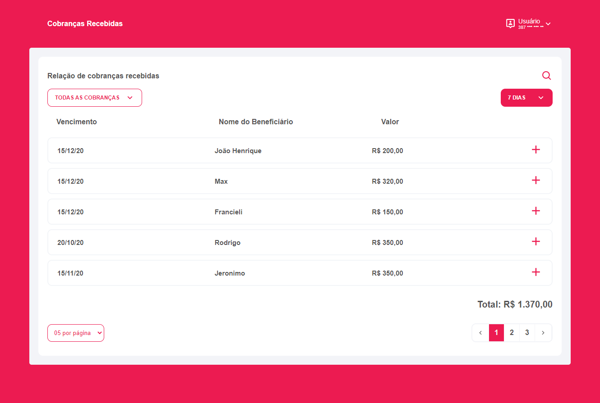

<h4 align="center">
  
</h4>

<h1 align="center"><b>Desafio MULTTI</b></h1>

### Nesse desafio foi construido um dashboard front-end criado com ReactJS.

<h4 align="center">
  
</h4>

# 🛠 <b>Tecnologias</b>

As seguintes ferramentas foram usadas na construção do projeto:

## Front-end

- [ReactJS](https://reactjs.org/)
- [Styled Components](https://styled-components.com/)
- [React Icons](https://react-icons.github.io/react-icons/)

<br>

# <b>🔥 Instalação</b>

Antes de começar, você vai precisar ter instalado em sua máquina as seguintes ferramentas:
[Git](https://git-scm.com), [Node.js](https://nodejs.org/en/).

Após isso, vamos aos próximos passos.

<br>

Comece clonando este repositório.

```bash
git clone https://github.com/RodzAlves/desafio-multti.git
```

Depois disso acesse a pasta do projeto.

```bash
cd desafio-multti
```

Instale as dependências tanto do projeto

```bash
cd desafio-multti (no terminal para entrar na pasta do projeto)
```

E rode o comando (yarn apenas se tiver o yarn instalado):

```bash
npm install ou yarn
```

## <b>↔️ Rodando o front-end</b>

Após ter instalado as dependências, basta rodar o comando no terminal:

```bash
yarn start ou npm run start

# O servidor iniciará na porta:3000 - acesse http://localhost:3000
```

<br>
Feito com 💜 por Rodrigo Alves 👋 <br>
<a href="https://www.linkedin.com/in/rodrigo-alves-dev/" alt="LinkedIn" target="blank">

   <p align="left" >
  <a href="mailto:rodrigoalvesbrasileiro@gmail.com" alt="Gmail">
  </a>
  
  <a href="https://www.linkedin.com/in/rodrigo-alves-dev/" alt="Linkedin">
  </a>

</p>
  </a>
